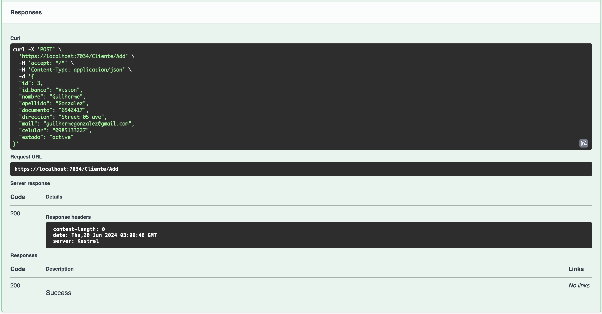
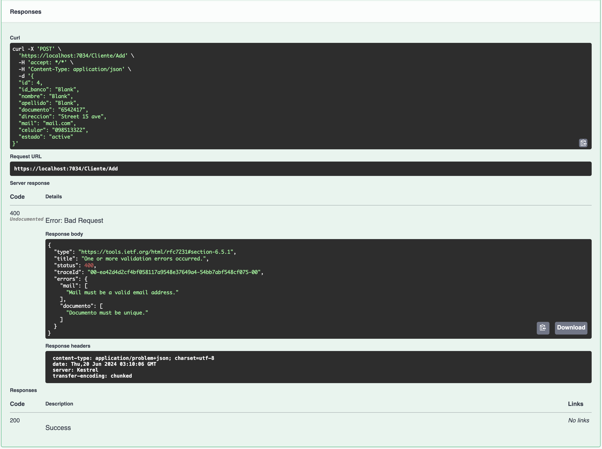
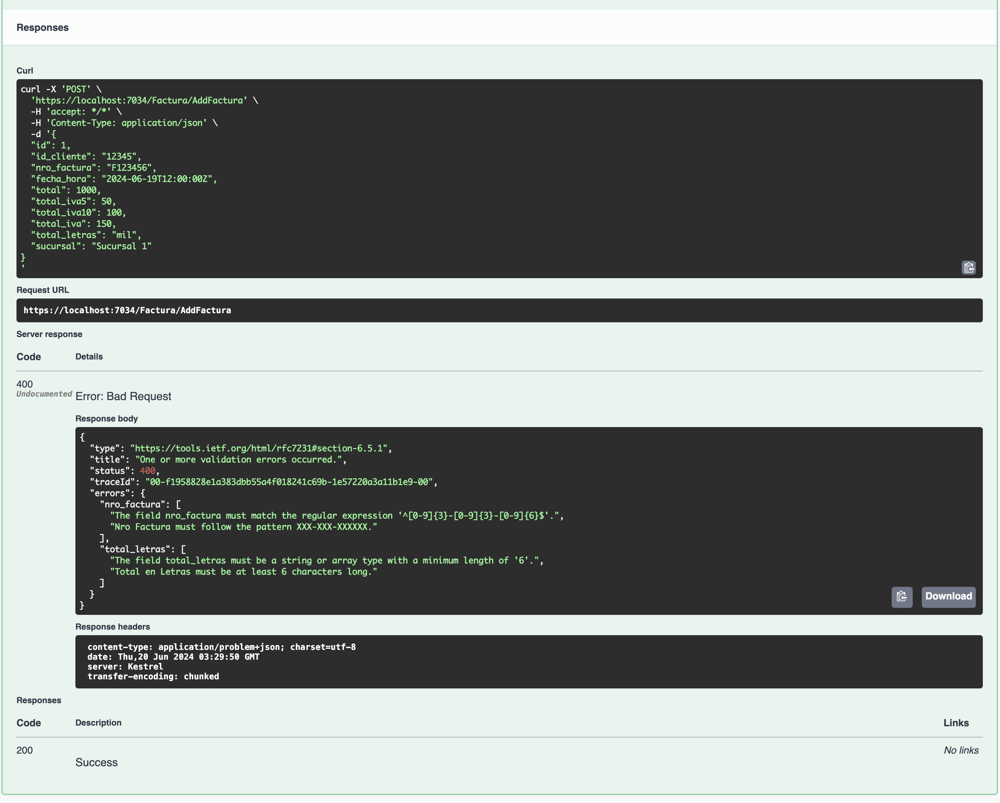

# .NET API Project outline

## Description
**PARCIAL 1 =>** In this project we are building a simple CRUD and list .NET API that interacts with a PostreSQL docker container using Dapper.

**PARCIAL 2 =>** Instead of Dapper we are now using EntityFramework and adding ORMs instead of manually executing DDL statements on the database, and also we have Migrations setup with ```dotnet ef```

The Interfaces, Models, Repositories, Services and Controllers were all modified to use EntityFramework.

**PARCIAL 3 =>** Building on top of the existing code, we added Validations using FluentValidation, to ensure a better user experience in Swagger and prevent badly formated data to get into the database. To accomplish this we made a new directory in the ```services``` layer named "Validations" that contains 2 validation classes (ClienteValidation.cs & FacturaValidation.cs).

We also made some changes to Controllers, Services, and Program.cs to implement this new feature.

## Directories

This project has 3 main folders:

1. api.personas (contains controllers, settings and the main program)
2. Repository (contains interfaces, classes, sql ddl statements, and ContextDB)
3. Services (contains services and validations)

```bash
api.personas
├── Controllers
│   ├── ClienteController.cs
│   ├── FacturaController.cs
│   └── WeatherForecastController.cs
├── Program.cs
├── Properties
│   └── launchSettings.json
├── WeatherForecast.cs
├── api.personas.csproj
├── appsettings.Development.json
├── appsettings.json 
```
  
```bash
Repository
├── Context
│   └── ContextAppDB.cs
├── DDL
│   ├── cliente.sql
│   └── factura.sql
├── Data
│   ├── ClienteModel.cs
│   ├── ClienteRepository.cs
│   ├── DbConection.cs
│   ├── FacturaModel.cs
│   ├── FacturaRepository.cs
│   ├── ICliente.cs
│   └── IFactura.cs
├── Migrations
│   ├── 20240522183604_InitialMigration.Designer.cs
│   ├── 20240522183604_InitialMigration.cs
│   └── ContextAppDBModelSnapshot.cs
```
```bash 
Services
├── Logica
│   ├── ClienteService.cs
│   └── FacturaService.cs
├── Validations
│   ├── ClienteValidation.cs
│   └── FacturaValidation.cs
```

## Validations
```C#
//Services/Validations/ClienteValidation.cs
using FluentValidation;
using Repository.Data;
using Services.Logica;
using Microsoft.Extensions.DependencyInjection;

namespace api.personas.Validation
{
    public class ClienteValidation : AbstractValidator<ClienteModel>
    {
        private readonly ClienteService _clienteService;

        public ClienteValidation(ClienteService clienteService)
        {
            _clienteService = clienteService;

            RuleFor(cliente => cliente.nombre)
                .NotEmpty().WithMessage("Nombre is required.")
                .MinimumLength(3).WithMessage("Nombre must be at least 3 characters long.");

            RuleFor(cliente => cliente.apellido)
                .NotEmpty().WithMessage("Apellido is required.")
                .MinimumLength(3).WithMessage("Apellido must be at least 3 characters long.");

            RuleFor(cliente => cliente.documento)
                .NotEmpty().WithMessage("Documento is required.")
                .MinimumLength(7).WithMessage("Documento must be at least 7 characters long.")
                .Must(documento => BeUniqueDocumento(documento)).WithMessage("Documento must be unique.");

            RuleFor(cliente => cliente.celular)
                .NotEmpty().WithMessage("Celular is required.")
                .MaximumLength(10).WithMessage("Celular cannot be longer than 10 digits.")
                .Matches("^[0-9]+$").WithMessage("Celular must contain only numbers.");

            RuleFor(cliente => cliente.id_banco)
                .NotEmpty().WithMessage("Id Banco is required.");

            RuleFor(cliente => cliente.direccion)
                .NotEmpty().WithMessage("Direccion is required.");

            RuleFor(cliente => cliente.mail)
                .NotEmpty().WithMessage("Mail is required.")
                .EmailAddress().WithMessage("Mail must be a valid email address.");

            RuleFor(cliente => cliente.estado)
                .NotEmpty().WithMessage("Estado is required.");

            RuleFor(cliente => cliente)
                .Must(cliente => IsActive(cliente.estado)).WithMessage("Customer data can only be retrieved if the status is active.");
        }

        private bool BeUniqueDocumento(string documento)
        {
            // Perform the uniqueness check synchronously
            return _clienteService.IsDocumentoUnique(documento).Result;
        }

        private bool IsActive(string estado)
        {
            return string.Equals(estado, "active", StringComparison.OrdinalIgnoreCase);
        }
    }
}
```

## Now when you use swagger and the action works, you won't get any extra logs


## And if you input something wrong, Swagger will output a simple to understand error message



```C#
//Services/Validations/FacturaValidation.cs
using FluentValidation;
using Repository.Data;
using System;
using System.Globalization;

namespace api.personas.Validation
{
    public class FacturaValidation : AbstractValidator<FacturaModel>
    {
        public FacturaValidation()
        {
            RuleFor(factura => factura.id_cliente)
                .NotEmpty().WithMessage("Id Cliente is required.");

            RuleFor(factura => factura.nro_factura)
                .NotEmpty().WithMessage("Nro Factura is required.")
                .Matches("^[0-9]{3}-[0-9]{3}-[0-9]{6}$").WithMessage("Nro Factura must follow the pattern XXX-XXX-XXXXXX.");

            RuleFor(factura => factura.fecha_hora)
                .NotEmpty().WithMessage("Fecha Hora is required.")
                .Must(BeValidSwaggerDateTime).WithMessage("Fecha Hora must be in the format 'yyyy-MM-ddTHH:mm:ssZ', e.g., '2018-03-20T09:12:28Z'");

            RuleFor(factura => factura.total)
                .NotEmpty().WithMessage("Total is required.")
                .GreaterThanOrEqualTo(0).WithMessage("Total must be a positive value.")
                .Must(BeNumeric).WithMessage("Total must be a numeric value.");

            RuleFor(factura => factura.total_iva5)
                .NotEmpty().WithMessage("Total IVA 5% is required.")
                .GreaterThanOrEqualTo(0).WithMessage("Total IVA 5% must be a positive value.")
                .Must(BeNumeric).WithMessage("Total IVA 5% must be a numeric value.");

            RuleFor(factura => factura.total_iva10)
                .NotEmpty().WithMessage("Total IVA 10% is required.")
                .GreaterThanOrEqualTo(0).WithMessage("Total IVA 10% must be a positive value.")
                .Must(BeNumeric).WithMessage("Total IVA 10% must be a numeric value.");

            RuleFor(factura => factura.total_iva)
                .NotEmpty().WithMessage("Total IVA is required.")
                .GreaterThanOrEqualTo(0).WithMessage("Total IVA must be a positive value.")
                .Must(BeNumeric).WithMessage("Total IVA must be a numeric value.");

            RuleFor(factura => factura.total_letras)
                .NotEmpty().WithMessage("Total en Letras is required.")
                .MinimumLength(6).WithMessage("Total en Letras must be at least 6 characters long.")
                .Matches("^[a-zA-Z]+$").WithMessage("Total en Letras must contain only letters.");

            RuleFor(factura => factura.sucursal)
                .NotEmpty().WithMessage("Sucursal is required.");
        }

        private bool BeValidSwaggerDateTime(string fechaHora)
        {
            return DateTime.TryParseExact(
                fechaHora,
                "yyyy-MM-ddTHH:mm:ssZ",
                CultureInfo.InvariantCulture,
                DateTimeStyles.None,
                out _);
        }

        private bool BeNumeric(decimal value)
        {
            return value.GetType() == typeof(decimal);
        }
    }
}
```

## Transitioning from Dapper to EntityFramework

DDL statements are now replaced by ORMs, and we now have database migrations setup using ```dotnet ef```

```C#
//Repository/Data/ClienteModel.cs
public class ClienteModel
    {
        public int Id { get; set; }
        public string id_banco { get; set; }

        [Required]
        [MinLength(3)]
        public string nombre { get; set; }

        [Required]
        [MinLength(3)]
        public string apellido { get; set; }

        [Required]
        [MinLength(3)]
        public string documento { get; set; }

        public string direccion { get; set; }
        public string mail { get; set; }

        [StringLength(10)]
        [RegularExpression("^[0-9]+$")]
        public string celular { get; set; }

        public string estado { get; set; }
    }
```
```C#
//Repository/Context/ContextAppDB.cs
using Microsoft.EntityFrameworkCore;
using Repository.Data;

namespace Repository.Context
{
    public class ContextAppDB : DbContext
    {
        public DbSet<ClienteModel> Clientes { get; set; }
        public DbSet<FacturaModel> Facturas { get; set; } 

        public ContextAppDB(DbContextOptions<ContextAppDB> options) : base(options)
        {
        }

        protected override void OnModelCreating(ModelBuilder modelBuilder)
        {
            modelBuilder.Entity<ClienteModel>().ToTable("cliente");
            modelBuilder.Entity<FacturaModel>().ToTable("factura");
        }
    }
}
```

#### Old DDL statement that was previously manually executed "```cliente.sql```"
```sql
CREATE TABLE IF NOT EXISTS public.cliente (
      id serial4 PRIMARY KEY,
      id_banco VARCHAR(255),
      nombre VARCHAR(255) NOT NULL CHECK (char_length(nombre) >= 3),
      apellido VARCHAR(255) NOT NULL CHECK (char_length(apellido) >= 3),
      documento VARCHAR(255) NOT NULL CHECK (char_length(documento) >= 3),
      direccion VARCHAR(255),
      mail VARCHAR(255),
      celular CHAR(10) CHECK (celular ~ '^[0-9]+$'),
      estado VARCHAR(255)
);
```
## EntityFramework Screenshots 
### Changed Dapper to EntityFramework


### dotnet ef database update


### Checking Migration History in postgres

## Swagger Screenshots

### Swagger UI


### Clientes CRUD and List

#### 1. Add

#### 2. Get

#### 3. Update

#### 4. Delete

#### 5. List

#### 6. Postgres query


### Facturas CRUD and List

#### 1. Add

#### 2. Get

#### 3. Update

#### 4. Delete

#### 5. List

#### 6. Postgres query

