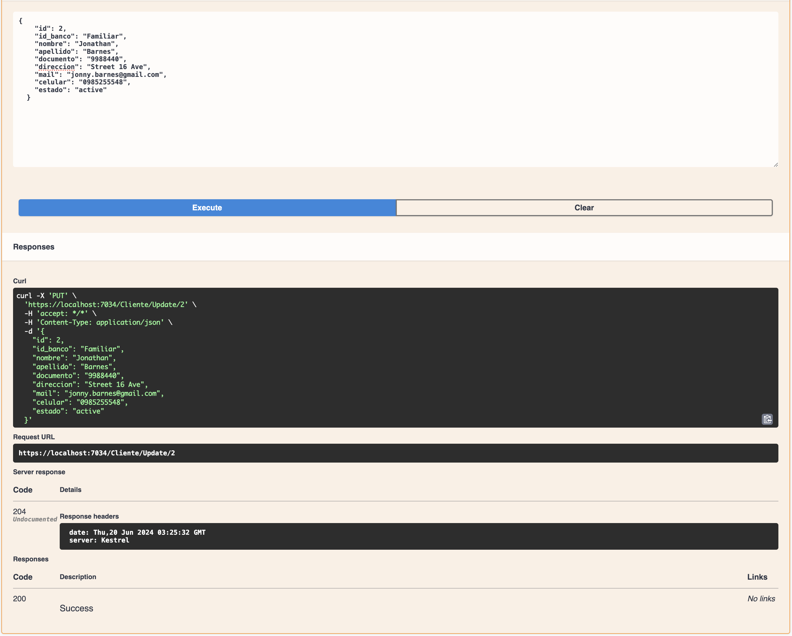

# .NET API Project outline

## Description
**PARCIAL 1 =>** In this project we are building a simple CRUD and list .NET API that interacts with a PostreSQL docker container using Dapper.

**PARCIAL 2 =>** Instead of Dapper we are now using EntityFramework and adding ORMs instead of manually executing DDL statements on the database, and also we have Migrations setup with ```dotnet ef```

The Interfaces, Models, Repositories, Services and Controllers were all modified to use EntityFramework.

## Directories

This project has 3 main folders:

1. api.personas (contains controllers, settings and the main program)
2. Repository (contains interfaces, classes, sql ddl statements)
3. Services (contains services)

```bash
api.personas
├── Controllers
│   ├── ClienteController.cs
│   ├── FacturaController.cs
│   └── WeatherForecastController.cs
├── Program.cs
├── Properties
│   └── launchSettings.json
├── WeatherForecast.cs
├── api.personas.csproj
├── appsettings.Development.json
├── appsettings.json 
```
  
```bash
Repository
├── Context
│   └── ContextAppDB.cs
├── DDL
│   ├── cliente.sql
│   └── factura.sql
├── Data
│   ├── ClienteModel.cs
│   ├── ClienteRepository.cs
│   ├── DbConection.cs
│   ├── FacturaModel.cs
│   ├── FacturaRepository.cs
│   ├── ICliente.cs
│   └── IFactura.cs
├── Migrations
│   ├── 20240522183604_InitialMigration.Designer.cs
│   ├── 20240522183604_InitialMigration.cs
│   └── ContextAppDBModelSnapshot.cs
```
```bash
Services
├── Logica
│   ├── ClienteService.cs
│   └── FacturaService.cs
```
## Transitioning from Dapper to EntityFramework

DDL statements are now replaced by ORMs, and we now have database migrations setup using ```dotnet ef```

```C#
//Repository/Data/ClienteModel.cs
public class ClienteModel
    {
        public int Id { get; set; }
        public string id_banco { get; set; }

        [Required]
        [MinLength(3)]
        public string nombre { get; set; }

        [Required]
        [MinLength(3)]
        public string apellido { get; set; }

        [Required]
        [MinLength(3)]
        public string documento { get; set; }

        public string direccion { get; set; }
        public string mail { get; set; }

        [StringLength(10)]
        [RegularExpression("^[0-9]+$")]
        public string celular { get; set; }

        public string estado { get; set; }
    }
```
```C#
//Repository/Context/ContextAppDB.cs
using Microsoft.EntityFrameworkCore;
using Repository.Data;

namespace Repository.Context
{
    public class ContextAppDB : DbContext
    {
        public DbSet<ClienteModel> Clientes { get; set; }
        public DbSet<FacturaModel> Facturas { get; set; } 

        public ContextAppDB(DbContextOptions<ContextAppDB> options) : base(options)
        {
        }

        protected override void OnModelCreating(ModelBuilder modelBuilder)
        {
            modelBuilder.Entity<ClienteModel>().ToTable("cliente");
            modelBuilder.Entity<FacturaModel>().ToTable("factura");
        }
    }
}
```

#### Old DDL statement that was previously manually executed "```cliente.sql```"
```sql
CREATE TABLE IF NOT EXISTS public.cliente (
      id serial4 PRIMARY KEY,
      id_banco VARCHAR(255),
      nombre VARCHAR(255) NOT NULL CHECK (char_length(nombre) >= 3),
      apellido VARCHAR(255) NOT NULL CHECK (char_length(apellido) >= 3),
      documento VARCHAR(255) NOT NULL CHECK (char_length(documento) >= 3),
      direccion VARCHAR(255),
      mail VARCHAR(255),
      celular CHAR(10) CHECK (celular ~ '^[0-9]+$'),
      estado VARCHAR(255)
);
```
## EntityFramework Screenshots 
### Changed Dapper to EntityFramework


### dotnet ef database update


### Checking Migration History in postgres

## Swagger Screenshots

### Swagger UI


### Clientes CRUD and List

#### 1. Add

#### 2. Get

#### 3. Update

#### 4. Delete

#### 5. List

#### 6. Postgres query


### Facturas CRUD and List

#### 1. Add

#### 2. Get

#### 3. Update

#### 4. Delete

#### 5. List

#### 6. Postgres query

